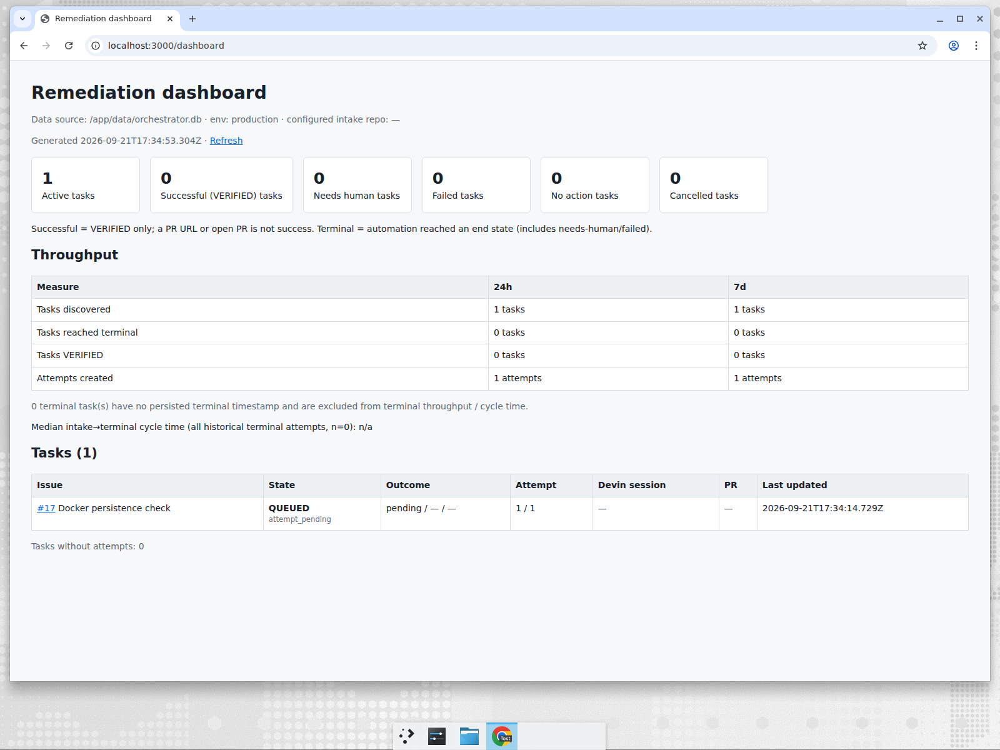

# Issue #18 — README clean-room walkthrough evidence

## Purpose

Verify that a new evaluator can understand, start, exercise, and inspect the
solution using only the README (and the documents it links), without prior
repository knowledge and without a public webhook endpoint. Record every
point where undocumented knowledge was needed and the README fixes that
followed.

## Method

- Fresh clone of the README branch at commit `f906c75` (README already
  restructured; `docs/operations.md` present) into an empty directory
  `/home/ubuntu/cleanroom/`, separate from the development checkout.
- Only the README's "Evaluator quick start" and the pages it links were
  consulted; no source code was read and no credentials were configured.
- Host: Ubuntu, Docker Engine 29.7.2, Docker Compose v5.4.0. No Node.js or
  pnpm were used.
- Recorded on 2026-09-21 (UTC).

## Commands executed (verbatim from the README)

```bash
git clone <repo> devin-superset-remediation
cd devin-superset-remediation
cp .env.example .env
docker compose up --build            # attached; log captured to compose-up.log
# second terminal, same directory
docker compose ps
curl http://localhost:3000/health
curl http://localhost:3000/ready
curl http://localhost:3000/api/report
# browser: http://localhost:3000/dashboard
```

## Results

### Startup without credentials

| Step                                              | Result                                                                                                                        |
| ------------------------------------------------- | ----------------------------------------------------------------------------------------------------------------------------- |
| `cp .env.example .env` (unmodified)               | OK — all credential variables left empty                                                                                      |
| `docker compose up --build`                       | Image built in ≈29 s; container `devin-superset-remediation-app-1` created                                                    |
| Time from `up` to `docker compose ps` = `healthy` | ≈114 s (build + start + 10 s healthcheck `start_period`)                                                                      |
| Startup log                                       | `Server listening at http://127.0.0.1:3000` / `http://172.18.0.2:3000`; three `level:40` (warn) lines, one per skipped poller |

The three warnings, exactly as logged (hostnames/timestamps elided):

```
"missing":["GITHUB_TOKEN","GITHUB_REPO_OWNER","GITHUB_REPO_NAME"],"msg":"GitHub intake polling skipped because configuration is incomplete"
"missing":["GITHUB_TOKEN","GITHUB_REPO_OWNER","GITHUB_REPO_NAME","DEVIN_API_KEY","DEVIN_ORG_ID"],"msg":"Devin dispatch polling skipped because configuration is incomplete"
"missing":["GITHUB_TOKEN","DEVIN_API_KEY","DEVIN_ORG_ID"],"msg":"Devin session tracking polling skipped because configuration is incomplete"
```

### Endpoints

| Endpoint      | Response                                                                                                                                           |
| ------------- | -------------------------------------------------------------------------------------------------------------------------------------------------- |
| `/health`     | `{"status":"ok","timestamp":"2026-09-21T17:34:07.395Z"}`                                                                                           |
| `/ready`      | `{"status":"ready","database":"connected","timestamp":"2026-09-21T17:34:07.400Z"}`                                                                 |
| `/api/report` | Valid JSON; `context` = `{"databasePath":"/app/data/orchestrator.db","nodeEnv":"production","configuredRepository":null}`; `summary.totalTasks: 0` |
| `/dashboard`  | HTML dashboard rendered; header shows data source, `env: production`, `configured intake repo: —`; all summary cards `0` on the fresh database     |

### Optional persistence check (Path A, from `docs/operations.md#persistence`)

Run exactly as documented: the `docker compose exec app node -e …` snippet
inserted task `#17 Docker persistence check` (attempt id 1); `/api/report`
then showed `totalTasks: 1`, state `QUEUED`. After `docker compose restart`
the same task was still present (`api-report-after-persistence.json`). The
dashboard screenshot below was taken after this step, which is why it shows
one active task.



`docker compose down -v` then removed the container and the
`orchestrator-data` volume.

### Understanding checks (README only)

| Question                                                            | Found in README?                                                                                                                                                  |
| ------------------------------------------------------------------- | ----------------------------------------------------------------------------------------------------------------------------------------------------------------- |
| Project purpose and architecture                                    | Yes — intro paragraph, "What the system does" flow diagram and component table, link to `architecture.md`                                                         |
| Start the application with Docker                                   | Yes — "Evaluator quick start" (first section after the TOC)                                                                                                       |
| Which credentials are required for real orchestration vs optional   | Yes — "Credentials and configuration" table (GitHub group + Devin group required for Path B; minimal/tuning groups optional; `GITHUB_WEBHOOK_SECRET` unused)      |
| How GitHub intake and Devin dispatch are triggered                  | Yes — "Path B" steps 2–5 and the "How work is triggered" table; polling intervals and the statement that no webhook/tunnel is needed                              |
| How to inspect and approve independent verification                 | Yes — "How to inspect results" (`verification-show.js`, `verification-propose.js`, `verification-approve.js` via `docker compose exec`), Path B step 6            |
| Where to see task state, Devin session, PR, verification, reporting | Yes — "How to inspect results" table (`/dashboard`, `/api/report`, `verification-show`, logs, SQLite volume)                                                      |
| What counts as success                                              | Yes — "What counts as success" (`VERIFIED` only)                                                                                                                  |
| Real vs demo/manual/evidence flows                                  | Yes — "Real vs. demo / manual / evidence flows" table with links to per-issue evidence; "How work is triggered" labels each trigger as real / manual / smoke test |
| Major known limitations                                             | Yes — "Known limitations and trust boundaries" is a top-level section (not only inside the verification detail)                                                   |

### Points where undocumented knowledge was needed

Recorded while following the README literally, before any fix:

1. **"once the `app` container reports healthy"** — the quick start did not
   say how to observe that (`docker compose ps`), nor roughly how long the
   first build takes.
2. **`docker compose up --build` runs attached** — the reader has to know to
   leave that terminal running and that Ctrl-C stops the service; "in
   another terminal" implied it but did not state it.
3. **`docker compose exec …` operator commands** assume the caller is in the
   repository directory with the service up; neither the README nor
   `docs/operations.md` stated this.

No other gaps: every command in the quick start and in the linked persistence
check worked verbatim, and all README → `docs/operations.md` anchors resolved.

### README changes made after the walkthrough

- Quick start now states that `docker compose up` stays attached (Ctrl-C
  stops it), adds `docker compose ps` as the first command in the second
  terminal with the expected `healthy` status, and gives the observed
  first-build (~1–2 min) vs subsequent (~10 s) time-to-healthy.
- "How to inspect results" now states that the `docker compose exec …`
  commands must be run from the repository directory while the service is
  up.

## Scope of this evidence

- This walkthrough covers **Path A** (no credentials). No GitHub or Devin
  credentials were configured and no new Devin session was created for
  Issue #18.
- Real-run capability (Path B) is **not** re-demonstrated here; it is
  evidenced by the earlier recordings linked from the README:
  [issue-8-9-real-dispatch.md](issue-8-9-real-dispatch.md),
  [issue-11-session-pr-lifecycle.md](issue-11-session-pr-lifecycle.md),
  [issue-13-independent-verification.md](issue-13-independent-verification.md),
  [issue-15-reporting.md](issue-15-reporting.md),
  [issue-17-docker.md](issue-17-docker.md).
- The persistence check inserts a task directly through the compiled
  application code; it is a manual evidence step and not part of the real
  workflow, as the README states.

## Acceptance criteria mapping

| Criterion                                                             | Evidence                                                                                                |
| --------------------------------------------------------------------- | ------------------------------------------------------------------------------------------------------- |
| Primary Docker quick start identifiable in the first section(s)       | "Evaluator quick start" is the first section after the TOC                                              |
| Clean checkout starts using only the documented instructions          | "Startup without credentials" above                                                                     |
| Short path clone → running service → dashboard/report                 | Quick start; "Endpoints" above                                                                          |
| Trigger/exercise without a public webhook or tunnel                   | README intro, Path B, "How work is triggered"; polling-only intake confirmed by the startup log         |
| Real orchestration distinguished from demo/manual/evidence flows      | "Real vs. demo / manual / evidence flows", "How work is triggered" kind column                          |
| Required credentials distinguished from optional configuration        | "Credentials and configuration" table                                                                   |
| Links/commands for task state, verification, sessions, PRs, reporting | "How to inspect results"                                                                                |
| Known limitations visible at top level                                | "Known limitations and trust boundaries"                                                                |
| No claims stronger than recorded evidence                             | "Scope of this evidence" above; README explicitly notes Path B was not re-run for this walkthrough      |
| Existing detailed documentation linked rather than duplicated         | Stage details moved to `docs/operations.md`; `architecture.md`, `product.md`, per-issue evidence linked |
